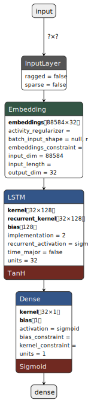

# Sentiment Analysis for Movie reviews using LSTM RNNs

*the process of computationally identifying and categorizing opinions expressed in a piece of text, especially in order to determine whether the writer's attitude towards a particular topic, product, etc. is positive, negative, or neutral.*

The example we’ll use here is classifying movie reviews as either postive, negative.

*This guide is based on the following tensorflow tutorial: https://www.tensorflow.org/tutorials/text/text_classification_rnn*

## Movie Review Dataset
Well start by loading in the IMDB movie review dataset from keras. 
This dataset contains 25,000 reviews from IMDB where each one is already preprocessed and has a label as either positive or negative. 
Each review is encoded by integers that represents how common a word is in the entire dataset. For example, a word encoded by the integer 3 means that it is the 3rd most common word in the dataset.

## More Preprocessing
If we have a look at some of our loaded in reviews, we'll notice that they are different lengths. This is an issue. We cannot pass different length data into our neural network. Therefore, we must make each review the same length. To do this we will follow the procedure below:
- if the review is greater than 250 words then trim off the extra words
- if the review is less than 250 words add the necessary amount of 0's to make it equal to 250.

Luckily for us keras has a function that can do this for us:

## Creating the Model
We'll use a word embedding layer as the first layer in our model and add a LSTM layer afterwards that feeds into a dense node to get our predicted sentiment. 

32 stands for the output dimension of the vectors generated by the embedding layer. We can change this value if we'd like!

## Model architecture

  <table>
    <tr>
      <td><b><i>LSTM Model</i></b></td>
    </tr>
    <tr>
      <td>
        

          
        

      </td>
    </tr>
  </table>

